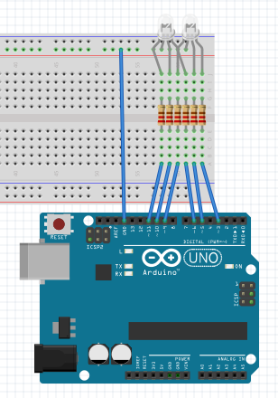
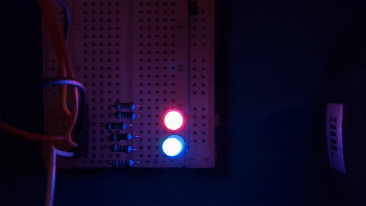

# **Inversive Red/Blue**
## 2 LEDs slowly change their colors from red to blue inversely to each other.
## **Components**
1. Breadboard
2. 2 RGB LEDs
3. 6 resistors
4. Male-to-Male jumper wires
## **Components connection instructions**
1. _Connect jumper wire to the ground pin and to positive/negative row (according to your LED common leg sign (cathode/anode))._
2. _Connect LEDs as shown on scheme:_
    - Common leg to the ground;
    - RGB legs to different columns without any whitespaces between legs.
3. _Connect resistors with compatible resistors:_
    - Compute required resistance considering 5V default output of Arduino pins using following formula:  **R = ∆U/I**, where **R** is resistor nominal in Ohms, **∆U** is Arduino output voltage (=5V), **I** is the current strength in Amp
    - Connect the resistor to the column of corresponding color leg.
4. _Connect jumper wires to the PMW (!) pins and the same to LEDs columns below the resistors respectively._
## **Scheme**

## **Demo**
