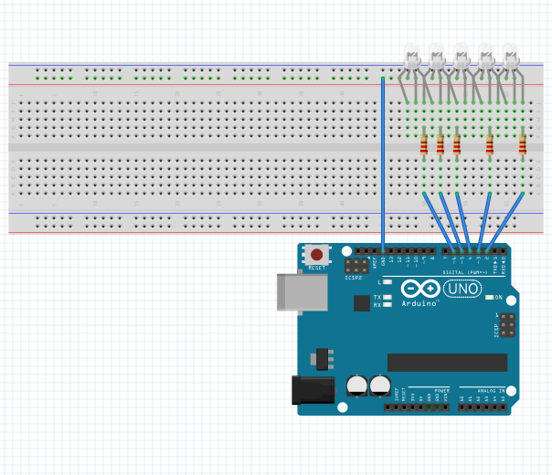

# **Running LED.**
## 5 LEDs go off and on one by one, creating a running LED effect.
## **Components**
1. Breadboard.
2. 5 RGB LEDs.
3. 5 resistors to decrease voltage.
4. Male-to-Male jumper wires.
## **Components connection instructions**
1. _Connect jumper wire to the ground pin and to positive/negative row (according to your LED common leg sign (cathode/anode)._
2. _Connect LEDs as shown on scheme:_
    - Common leg to the ground;
    - RGB legs to different columns without any whitespaces.
3. _Connect resistors with compatible resistors:_
    - Compute required resistance considering 5V default output of Arduino pins using following formula:  **R = ∆U/I**, where **R** is resistor nominal in Ohms, **∆U** is Arduino output voltage (=5V), **I** is the current strength in Amp
    - Connect the resistor to the column of corresponding color leg.
4. _Connect jumper wires to the pins and the same columns below the resistors respectively._
## **Scheme**

## **Demo**
<video src=".src/demo.mp4" autoplay controls width=20% muted>